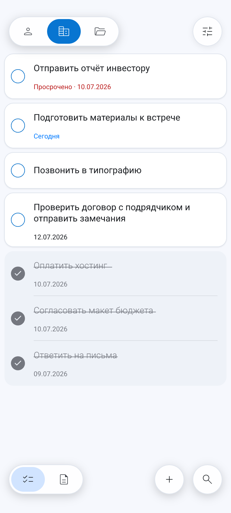
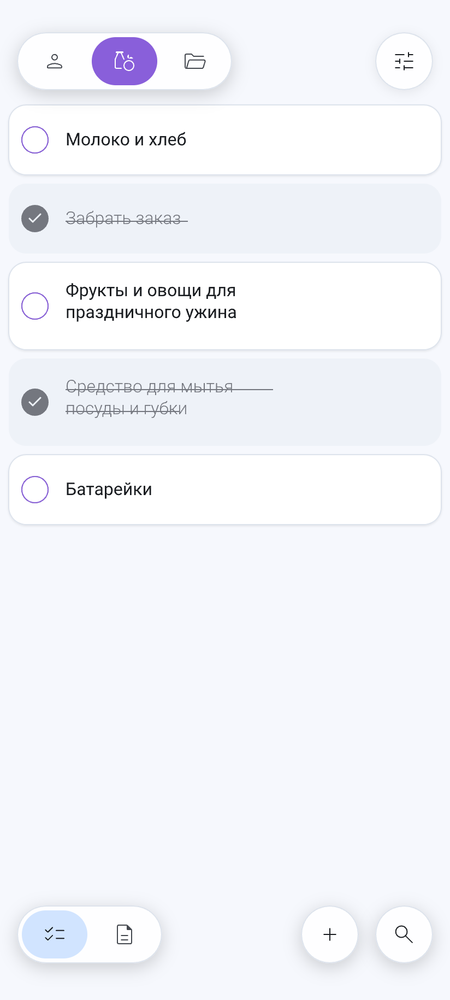
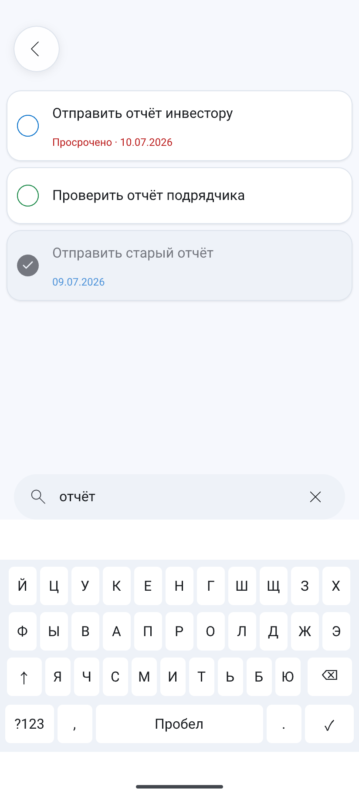
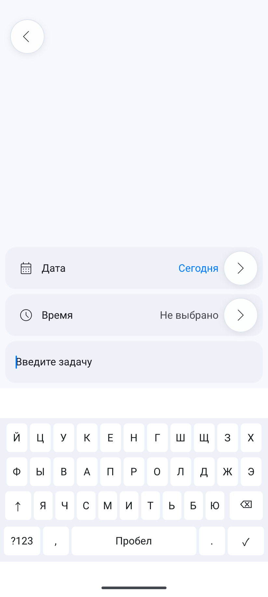
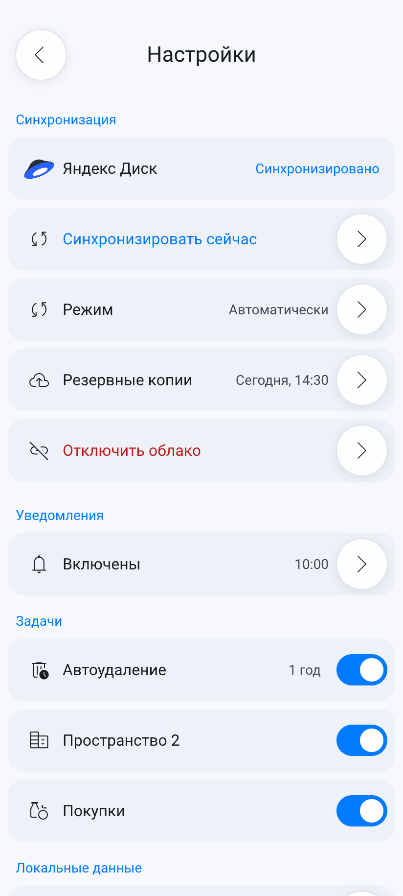

# XorV — загрузки

Официальный репозиторий APK-релизов Android-приложения XorV.

XorV помогает спокойно организовать личные задачи, покупки и текстовые
заметки. Приложение работает по принципу local-first: основные функции доступны
без Интернета, а локальная база остаётся главным источником данных.

## Текущая версия

**XorV 1.3.2** (`versionCode 43`)

- имя пакета: `app.xorv`;
- минимальная версия системы: Android 7.0 (API 24);
- платформа: Android;
- архитектура: local-first.

Скачать подписанный APK:
[XorV-1.3.2-vc43-20261004-135541-release.apk](https://github.com/robotovnet/xorv-releases/releases/latest/download/XorV-1.3.2-vc43-20261004-135541-release.apk).

SHA-256:

```text
9e73116bf95c7665d2ef309e9c880e1a81c58240f5b6bdd574c442bc24c25838
```

Полное описание версии находится на странице
[XorV 1.3.2 (versionCode 43)](https://github.com/robotovnet/xorv-releases/releases/tag/v1.3.2-vc43).

## Что нового в версии 1.3.2

- локальные экспорт и импорт ZIP снова работают без подключённого облака;
- устранён ложный запрос облачной авторизации при локальном переносе данных;
- сохранены блокирующие проверки при обнаружении несовместимого маркера или
  ошибках облачного провайдера и сети;
- исправлено перекрытие интерфейса системной панелью навигации и клавиатурой;
- скорректирован нижний отступ кнопки сохранения.

Версия 1.3.2 включает все возможности версии 1.3:

- пространство «Покупки» с ручным порядком пунктов и быстрым действием
  «Купить»;
- индивидуальное однократное уведомление обычной задачи на выбранные дату и
  время;
- улучшенное перетаскивание задач и покупок без начального вертикального
  скачка;
- согласованные переходы между задачами, пространствами и заметками;
- редакторы задачи и покупки до пяти видимых строк;
- актуальные значки и порядок системных быстрых действий.

Также сохранены возможности версии 1.2:

- до трёх пространств задач с выбранными значками и цветами;
- глобальный поиск задач во всех активных пространствах;
- необязательное автоудаление завершённых задач через 1, 2 или 3 года;
- светлую и тёмную темы;
- резервные копии, восстановление и личную синхронизацию через Яндекс Диск;
- локальный экспорт и импорт данных.

## Интерфейс

Ниже показаны утверждённые экраны версии 1.3 из канонического дизайн-макета.

| Пространства задач | Покупки |
| --- | --- |
|  |  |

| Глобальный поиск | Индивидуальное уведомление |
| --- | --- |
|  |  |



## Установка APK

1. Откройте страницу Releases и выберите последнюю стабильную версию.
2. Скачайте файл `XorV-1.3.2-vc43-20261004-135541-release.apk`.
3. Сверьте SHA-256 файла со значением в описании релиза.
4. Разрешите Android установку приложений из используемого браузера или
   файлового менеджера.
5. Откройте APK и подтвердите установку.

Android может предупреждать об установке приложения не из магазина. Загружайте
APK только из Releases этого репозитория.

Для обновления установленного приложения новый APK должен быть подписан тем же
release-ключом. Не удаляйте приложение перед обновлением, если хотите сохранить
локальные данные.

## Данные и безопасность

- XorV не содержит рекламы и не продаёт пользовательские данные;
- локальная работа не требует учётной записи XorV;
- экспорт не содержит OAuth-токены и внутреннее состояние синхронизации;
- версия 1.3.2 не выполняет собственного сквозного шифрования содержимого.

Не храните в приложении пароли и другие секреты.

## Что не входит в версию 1.3.2

- совместные и семейные пространства;
- форматирование, вложения и защита заметок;
- голосовая диктовка и AI-функции;
- Google Drive;
- версии для iOS, web и desktop.
